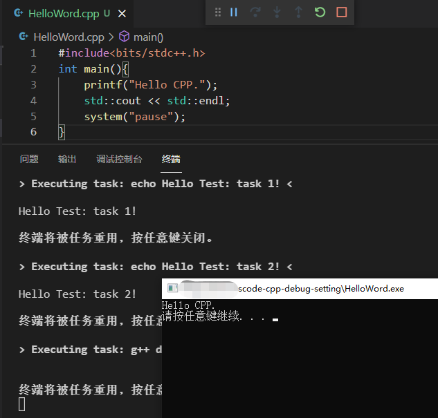

# vscode-cpp-debug-setting
C/C++ debug settings template for VSCode

## Usage

Minimal setting:

- set `c_cpp_properties.json`
  - change `"compilerPath": "C:\\msys64\\mingw64\\bin\\g++.exe"` into your own **g++** compiler
- set `launch.json`
  - change `"miDebuggerPath": "C:\\msys64\\mingw64\\bin\\gdb.exe"` into  your own **gdb** debugger

## Demo

Run: (`crtl+alt+B`)

## Prerequisites

- VS Code
  - VS Code C/C++ extension
- MinGW

